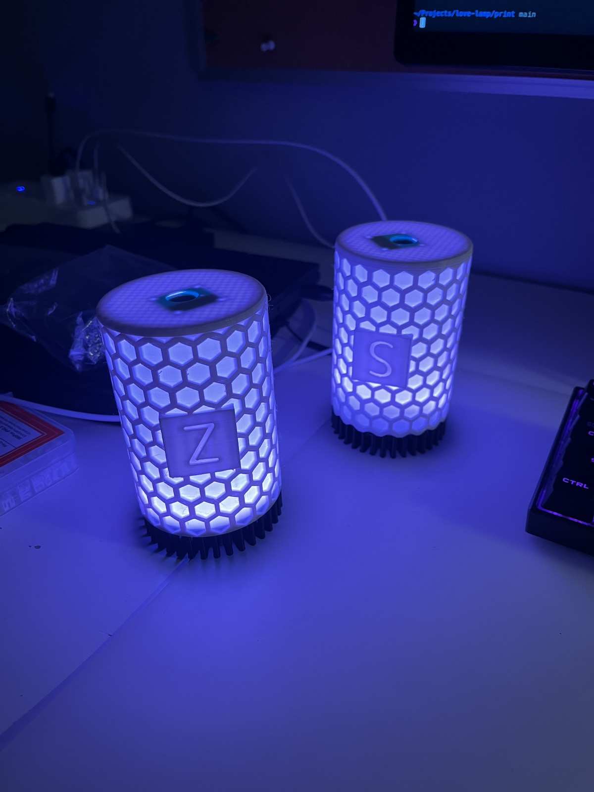

# Love Lamp

A pair of touch-activated lamps that light up together over WiFi. Tap one lamp to light up both, no matter where they are in the world.

<p align="center">
  
</p>

## Hardware

- [WEMOS ESP32 D1 Mini](https://www.amazon.com/dp/B08ND91YB8?ref=ppx_yo2ov_dt_b_fed_asin_title)
- [TTP223 capacitive touch sensor](https://www.amazon.com/dp/B00HFQEFWQ?ref=ppx_yo2ov_dt_b_fed_asin_title&th=1)
- [WS2812B 12-LED ring](https://www.amazon.com/dp/B0CMPQMMJD?ref=ppx_yo2ov_dt_b_fed_asin_title)
- 3D-printed enclosure (from [this project](https://www.instructables.com/Love-Lamp-1))

**Wiring**

| Component | Connection |
|-----------|------------|
| TTP223 VCC | 3.3V |
| TTP223 SIG | IO23 (D7) |
| LED VCC | 5V |
| LED DI | IO17 (D3) |
| GND | Shared |

Build two lamps — one flashed as **A**, one as **B**.

## Firmware

```bash
cd firmware
cp src/secrets.h.example src/secrets.h   # add HiveMQ Cloud credentials
pio run -e wemos_d1_mini32 -t upload     # Lamp A
pio run -e wemos_d1_mini32_B -t upload   # Lamp B
```

Lamps communicate over MQTT (`lovelamp/event` and `lovelamp/ack` topics). I used HiveMQ free tier which worked great. 

## Gestures

| Action | Result |
|--------|--------|
| Single tap | Cycle color and turn on (white → blue → pink → red → off) |
| Triple tap | Enter/exit WiFi setup portal (SSID: `lamp-setup`) |

Lamps auto-off after 30 minutes.
